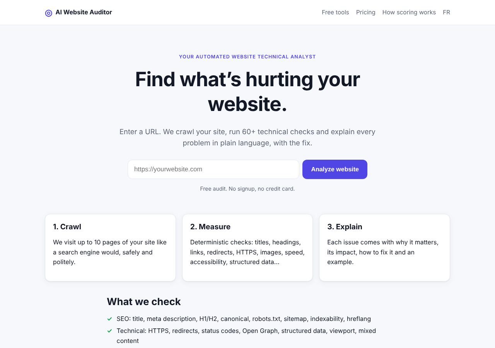
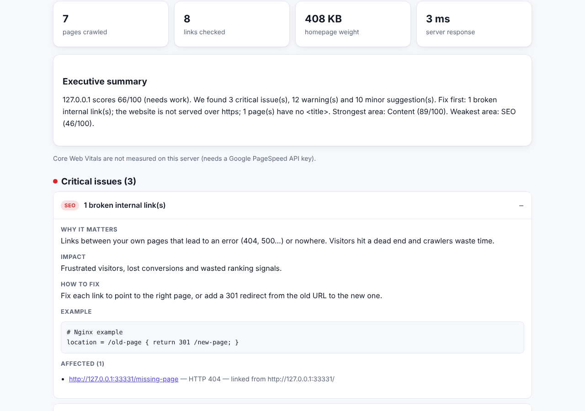
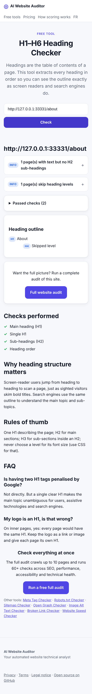

# AI Website Auditor

**Your automated website technical analyst.** Enter a URL: the auditor crawls the site, runs 60+ deterministic checks (SEO, performance, accessibility, technical, content), computes a transparent score and explains every problem in plain language, with its impact, the fix and an example. An optional AI layer turns the findings into a prioritised action plan.

> Cloud version: _coming soon (see [Deployment](docs/DEPLOYMENT.md))_ · Licence: MIT



| Report | Free tool (mobile) |
| --- | --- |
|  |  |

## Features

- **Bounded, polite crawler**: up to 10 pages, depth 2, respects robots.txt, identifies itself, strict timeouts and size limits.
- **60+ checks**: title, meta description, H1/H2, canonical, noindex, robots.txt, sitemap.xml, hreflang, broken internal/external links, redirect chains, HTTP status codes, HTTPS and certificate, mixed content, viewport, Open Graph, Twitter card, JSON-LD validity, HSTS, server response time, page weight, heavy images, WebP/AVIF, compression, render-blocking scripts, caching, image dimensions (CLS), lazy loading, alt text, form labels, button and link names, zoom, heading order, duplicate IDs, thin content, placeholder text, legal pages…
- **Explanations in English and French**: why it matters, impact, how to fix, example. [Full list](https://github.com/mxthis971/AI-Website-Auditor/blob/main/src/analyzer/catalog.js).
- **Transparent scoring**: overall + 5 categories, documented in [docs/SCORING.md](docs/SCORING.md).
- **Shareable report** (`/r/<id>`) with priority roadmap, printable to PDF.
- **Optional integrations**: Google PageSpeed Insights (Lighthouse + Core Web Vitals), Claude AI action plan, Stripe one-time payment for the full report.
- **8 free SEO tools**: meta tag, robots.txt, sitemap, heading, Open Graph, image alt, broken link and speed checkers.
- **Security first**: SSRF protection with DNS pinning, private-network blocking, re-validated redirects, rate limiting, strict CSP. See [docs/SECURITY.md](docs/SECURITY.md).
- **Privacy by design**: no account, no IP stored, reports auto-deleted after 30 days. Ads (Google AdSense) only load when `ADSENSE_CLIENT` is set.

## Architecture

```
Browser ──► Fastify server (Node 22)
             ├── Pages (server-rendered HTML, /static assets)
             ├── API  /api/audits, /api/reports, /api/tools …
             ├── Job queue (in-process, capped concurrency)
             │     └── Audit pipeline:  crawler ─► checks ─► scoring ─► report
             │            └── safe-fetch (SSRF guard, DNS pinning, limits)
             ├── SQLite (node:sqlite, one file)
             └── Optional: PageSpeed API · Claude API · Stripe
```

| Folder | Role |
| --- | --- |
| `src/security/` | URL validation, private-IP blocking, hardened HTTP client |
| `src/crawler/` | crawler, robots.txt and sitemap parsers |
| `src/analyzer/` | HTML facts extraction, checks, catalog (texts), scoring, PageSpeed |
| `src/ai/` | optional AI action plan (explains facts, never measures) |
| `src/report/` | localised report view and free/full gating |
| `src/payments/` | Stripe Checkout + webhook signature verification |
| `src/web/` | page routes, layout, tools, legal pages |
| `public/` | CSS, browser JS, images |
| `tests/` | 63 automated tests with local fixture websites |
| `docs/` | architecture, scoring, security, deployment, SEO and business docs |

Details: [docs/ARCHITECTURE.md](docs/ARCHITECTURE.md).

## Quick start (local development)

Requirements: **Node.js 22.13+** (uses the built-in `node:sqlite`).

```bash
git clone https://github.com/mxthis971/AI-Website-Auditor.git
cd AI-Website-Auditor
npm install
cp .env.example .env      # optional: edit values
npm run dev               # http://localhost:3000
```

Audit from the terminal:

```bash
npm run audit:cli -- https://example.com
npm run audit:cli -- https://example.com --lang=fr
npm run audit:cli -- https://example.com --json > report.json
```

Run the checks:

```bash
npm run lint
npm test
```

## Configuration

All settings are environment variables; see [.env.example](.env.example). Nothing secret is ever committed. Integrations switch on automatically when their keys are present:

| Variable | Enables |
| --- | --- |
| `PAGESPEED_API_KEY` | Lighthouse scores and Core Web Vitals |
| `ANTHROPIC_API_KEY` (+ `AI_MODEL`) | AI action plan in reports |
| `STRIPE_SECRET_KEY`, `STRIPE_WEBHOOK_SECRET`, `STRIPE_REPORT_PRICE_ID` | Paid full report (otherwise full reports are free, "beta mode") |
| `ADSENSE_CLIENT` (+ `ADSENSE_REPORT_SLOT`, `ADSENSE_TOOL_SLOT`) | Google AdSense script, `/ads.txt` and ad blocks on report and tool pages |
| `GOOGLE_SITE_VERIFICATION` | Google Search Console ownership `<meta>` tag |
| `METRICS_TOKEN` | `GET /api/metrics` (audits, error rate, average duration, pages crawled, counters) |

## Deployment

Free tier on Render with Docker (`render.yaml` included). Step-by-step guide: [docs/DEPLOYMENT.md](docs/DEPLOYMENT.md).

## Roadmap

See [docs/ROADMAP.md](docs/ROADMAP.md). Next: V1.1 premium report live, V1.2 accounts, V1.3 monitoring, V1.4 alerts, V2 automatic fixes, API, CLI, browser extension, GitHub/CI integration.

## Documentation

- [Architecture](docs/ARCHITECTURE.md) · [Scoring](docs/SCORING.md) · [Security](docs/SECURITY.md) · [Deployment](docs/DEPLOYMENT.md)
- [User guide](docs/USER-GUIDE.md) · [SEO keyword strategy](docs/SEO-STRATEGY.md) · [Business model](docs/BUSINESS.md) · [Roadmap](docs/ROADMAP.md)

## Licence

MIT, see [LICENSE](LICENSE). The hosted cloud version adds paid features on top of this open-source core.
